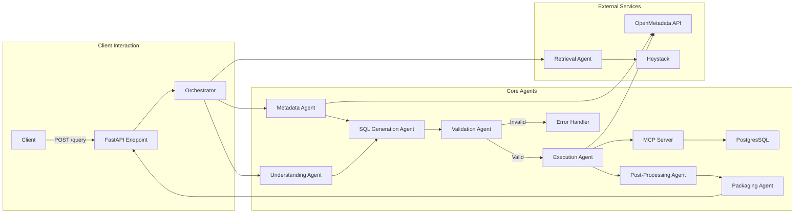

## SQL Copilot Architecture

A modular FastAPI-based service that converts natural language queries into SQL and returns the results in a structured JSON response.

---

### 1. Overview

* **Purpose**: Process client queries in natural language and translate them into SQL statements for execution.
* **Tech Stack**: Python, FastAPI, Mermaid (for diagrams), and various internal agents/services.

---

### 2. Core Components

| Component                 | Responsibility                                                           |
|---------------------------|--------------------------------------------------------------------------|
| **FastAPI App**           | Bootstraps the API, mounts routes, handles HTTP requests/responses.      |
| **Orchestrator Agent**    | Coordinates the end-to-end query processing workflow.                    |
| **Metadata Agent**        | Fetches database schema and metadata (via OpenMetadata API).             |
| **Understanding Agent**   | Parses the natural language prompt into intents and entities.            |
| **SQL Generation Agent**  | Synthesizes SQL queries using parsed intent and metadata.                |
| **Validation Agent**      | Verifies safety and syntax correctness of generated SQL.                 |
| **Execution Agent**       | Sends validated SQL to the MCP server for execution against PostgresSQL. |
| **Post-Processing Agent** | Transforms raw query results (e.g., formatting, type conversions).       |
| **Packaging Agent**       | Wraps the final SQL and data into the defined JSON response model.       |
| **Retrieval Agent**       | (Optional) Retrieves supplementary data via Heystack or other services.  |
| **Utilities**             | Logging, Caching, Error Handling, etc.                                   |

---

### 3. Request Flow

1. **Client Request**: `POST /query` with a `QueryRequest` payload.
2. **FastAPI Endpoint**: Receives request and invokes the Orchestrator.
3. **Orchestrator Agent**: Sequentially triggers:

    1. **Metadata Agent**: Retrieves schema details.
    2. **Understanding Agent**: Extracts user intent and relevant entities.
    3. **SQL Generation Agent**: Builds an initial SQL statement.
    4. **Validation Agent**: Ensures safety (e.g., no unauthorized access) and syntax.

        * If invalid, abort and return an error via the Error Handler.
    5. **Execution Agent**: Submits SQL to the MCP server.
    6. **Database Execution**: MCP interacts with PostgresSQL to run the query.
    7. **Post-Processing Agent**: Refines raw data (e.g., type casting, filtering).
    8. **Packaging Agent**: Constructs the `QueryResponse` model.
4. **Response**: FastAPI returns a structured JSON payload with:

    * The final SQL statement.
    * Query results (rows, column metadata).
    * Execution metadata (timing, warnings).

---

### 4. Architecture Diagram

---

### 5. Notes & Extensions

* **Scalability**: Agents can be distributed across multiple workers or containers.
* **Security**: Validation Agent enforces RBAC and SQL sanitization.
* **Observability**: Logging and metrics at each stage for monitoring and alerting.
* **Extensibility**: Add new agents (e.g., ML-based optimization) without altering the core flow.
