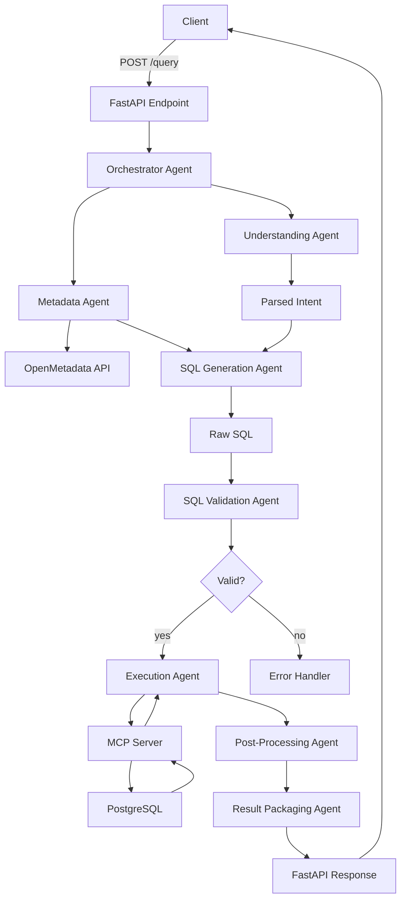

# SQL Copilot Architecture

This document describes the architecture of the SQL Copilot project.

## Overview

The SQL Copilot project is a FastAPI-based service that processes natural language queries, generates SQL, and returns results. It uses a modular architecture with various agents and services to handle different aspects of the query processing pipeline.

## Components

- **FastAPI App**: Bootstraps the application and mounts routes.
- **Agents**: Orchestrator, Metadata, Understanding, SQL Generation, Validation, Execution, Post-Processing, Packaging, and Retrieval agents.
- **Services**: OpenMetadata, MCP, Heystack, and DB services.
- **Utils**: Logging, Cache, and Error Handler utilities.

## Flow

1. Client sends a POST request to the `/query` endpoint with a natural language prompt.
2. The Orchestrator agent coordinates the processing of the query.
3. The Metadata agent fetches schema metadata.
4. The Understanding agent parses the prompt into intent and entities.
5. The SQL Generation agent synthesizes SQL from the parsed intent and metadata.
6. The Validation agent ensures the SQL is safe and syntactically correct.
7. The Execution agent forwards the SQL to the MCP server and returns raw results.
8. The Post-Processing agent transforms the raw results.
9. The Packaging agent wraps the final SQL and data into the JSON response model.
10. The response is returned to the client.

## Diagram

